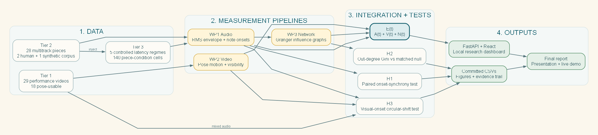
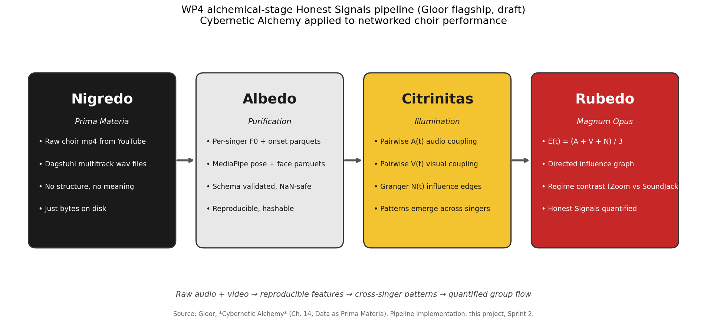
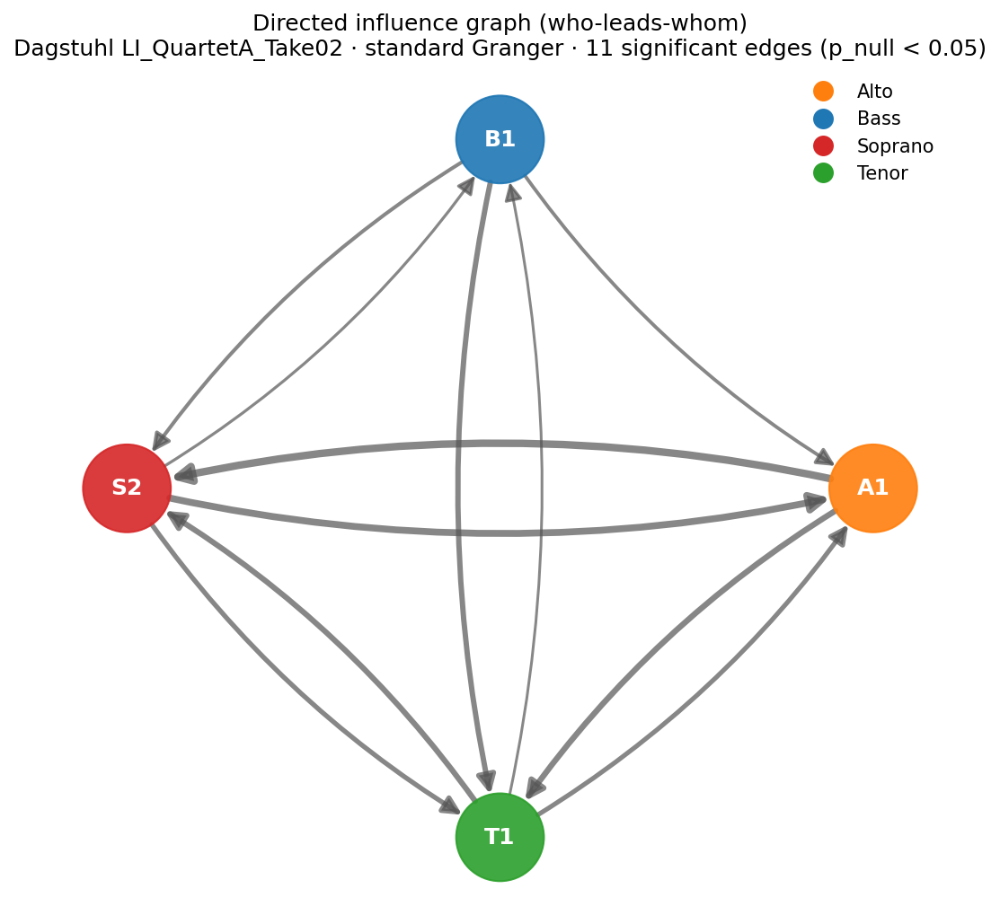
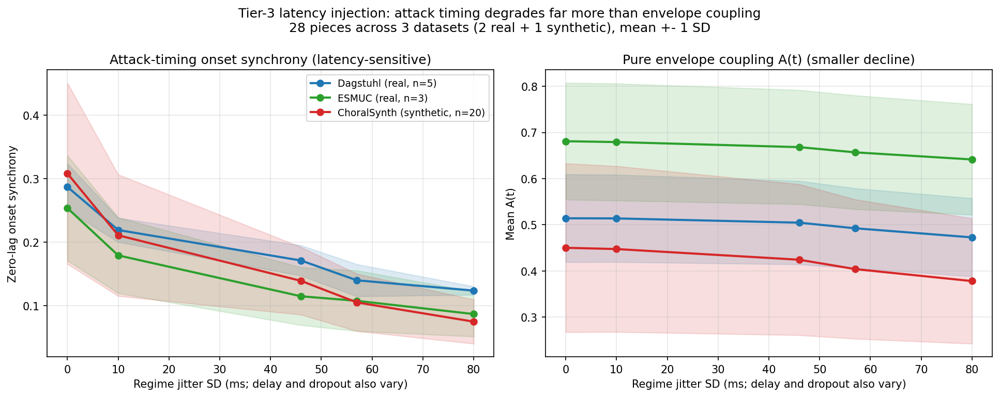
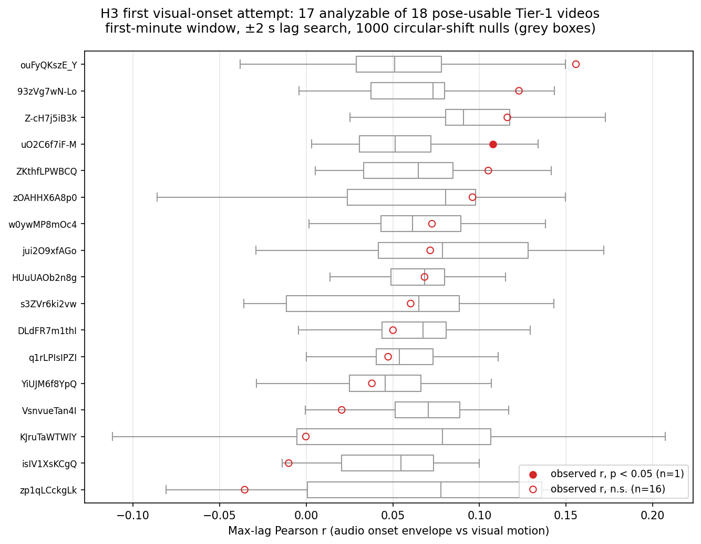
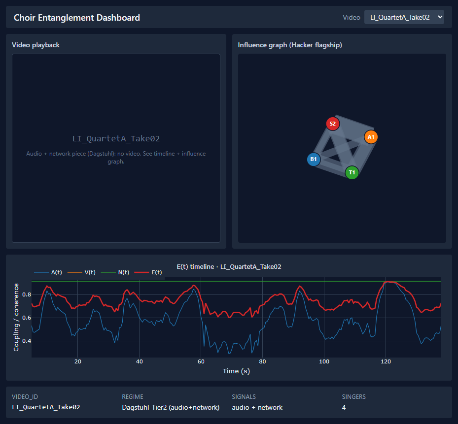

# Measuring Coordination in Online Choirs: An Entanglement Index and the Latency Signature of Ensemble Timing

**Authors:** Zuraiz, Hammad Anwar, Hassan Ahmed, Kumaran Vasu

**Course:** SNA-OSN-M Summer 2026, University of Bamberg, University of Cologne, and HSLU

**Supervisors:** Prof. Janine Hacker and Prof. Peter Gloor

**Date:** 31 July 2026

**Keywords:** networked music performance, choir coordination, latency, onset synchrony, Granger causality, pose tracking

## Abstract

Online choir performance is constrained by transmission delay, jitter, and packet loss, but the resulting loss of coordination is often described qualitatively. This project develops a reproducible measurement pipeline for acoustic, visual, and network coordination and evaluates the project's three declared hypotheses. H1 predicts that higher latency reduces coordination. H2 predicts that choir influence networks contain leadership structure. H3 predicts that visual signals add information beyond audio. We analyze 28 multitrack pieces from Dagstuhl ChoirSet, the ESMUC Choir Dataset, and ChoralSynth, together with 29 networked-performance videos. Controlled latency injection creates five conditions per multitrack piece and 140 analysis cells. From clean to Zoom-class conditions, zero-lag onset synchrony falls in all 28 pieces. Mean within-piece drops are 56.5% for Dagstuhl, 65.1% for ESMUC, and 75.1% for ChoralSynth, with an overall mean of 70.7% and an exact one-sided sign-test p-value of 3.73e-9. Loudness-envelope coupling falls an order of magnitude less, roughly 6% to 14% across corpora, showing that latency primarily damages note-attack timing rather than slow amplitude structure. H2 receives limited support: 2 of 8 human pieces show more out-degree centralization than matched random graphs, compared with 0 of 20 synthetic pieces. An exploratory H3 experiment pairs pose-derived motion with mixed-audio onset envelopes on 18 videos. Seventeen are analyzable and 1 of 17 is significant, consistent with chance. The full H3 delta-R-squared claim remains untested because no corpus provides synchronized per-singer audio and video. The result is a scoped, auditable account of what can and cannot be inferred from the available data.

## 1. Introduction

Networked Music Performance allows musicians in different locations to rehearse or perform through an audio network. The same network that enables the performance also alters it. Delay separates a singer's action from the sound received by collaborators, jitter makes that separation unstable, and packet loss removes or repeats parts of the signal. Existing systems reduce these effects, but evaluating whether an ensemble remains coordinated requires a measurable outcome.

Choirs provide a useful setting because coordination has an observable timing dimension. Singers can attack a note together or at different moments, and multitrack recordings preserve those differences at singer or voice-part level. The project therefore asks:

**How can acoustic, visual, and influence-network signals be combined to measure coordination in an online choir, and what does controlled network latency do to that coordination?**

The project adapts the entanglement concept from communication-network research [1] and the behavioral-signal perspective associated with Honest Signals [2]. The adaptation is not assumed to be valid merely because those concepts worked in another domain. Instead, the choir-specific measurements are treated as operational proposals that must survive controls and hypothesis tests.

The project contributes a tested latency result, an influence-network analysis, an exploratory multimodal experiment, and an integrated dashboard. The full pipeline links raw choir recordings to reproducible feature tables, statistical tests, figures, and presentation artifacts.

## 2. Related Work

### 2.1 Entanglement and behavioral signals

Gloor et al. define entanglement from temporal communication patterns in organizational networks [1]. Their evidence concerns email rhythms and team outcomes, not musical audio. Our E(t) therefore retains the idea of combining coordination signals over time but changes both the time scale and the source measurements. Equal weighting is used as a transparent baseline rather than an optimized model.

Pentland's Honest Signals framework emphasizes activity, consistency, influence, and mimicry as observable behavioral signals [2]. Choir performance offers direct timing outcomes that are less available in meetings or organizational communication. Pose-derived motion is used as an exploratory proxy for activity and mimicry, while directed influence is represented by Granger-causal networks.

### 2.2 Choir and networked-performance data

Dagstuhl ChoirSet provides aligned multitrack recordings and annotations for choir research [3]. The ESMUC Choir Dataset supplies open multitrack choir recordings [4]. ChoralSynth provides synthetic choral mixtures with separated voice parts and acts as a contrast corpus [5]. Synthetic voices are useful for method checks, but they are not treated as evidence of human behavior.

Networked-performance studies commonly report delay as a central constraint. Rather than asserting a universal latency cliff, this project uses five named regimes as controlled perturbation levels. The analysis asks whether metrics discriminate those levels within the same musical piece.

### 2.3 Influence networks and pose estimation

Granger causality tests whether past values of one series improve prediction of another [6]. Directed significant relations form a singer influence graph. Continuous ordinal-pattern preprocessing can improve sensitivity to nonlinear relations [7], although the final H2 centralization analysis uses a consistent standard graph definition across pieces. For video, MediaPipe BlazePose provides body landmarks suitable for estimating shoulder movement, head sway, and trunk lean [8].

## 3. Hypotheses

The hypotheses and their predicted directions were declared at project start. Their operational metrics were refined in documented, dated revisions when controls exposed measurement problems. Reporting that audit trail is part of the method rather than a claim of technical preregistration.

| Hypothesis | Operational question | Primary measurement | Final status |
|:--|:--|:--|:--|
| H1 | Does higher latency reduce coordination? | Within-piece change in zero-lag onset synchrony | Supported for the timing channel |
| H2 | Do choir influence networks contain leadership structure? | Out-degree Gini relative to matched random graphs | Partially supported for human recordings |
| H3 | Do visual signals explain coordination beyond audio? | Planned delta-R-squared comparison | Full claim untested; exploratory coupling is null |

The final results support H1 for the timing channel, provide limited evidence for H2, and leave the full H3 incremental-validity claim untested while reporting a null exploratory coupling experiment.

## 4. Method

### 4.1 Data and provenance

The project uses three data tiers. Tier 1 contains networked-performance videos with mixed audio. Tier 2 contains per-singer or per-part multitrack audio. Tier 3 is generated by injecting controlled degradation into Tier-2 recordings.

| Corpus | Type | Analysis units | Main role |
|:--|:--|--:|:--|
| Dagstuhl ChoirSet | Human multitrack audio | 5 pieces | H1 and H2 |
| ESMUC Choir Dataset | Human multitrack audio | 3 full-ensemble pieces | H1 and H2 |
| ChoralSynth | Synthetic separated parts | 20 pieces | H1 and synthetic H2 control |
| Tier-1 videos | Mixed audio plus video | 29 videos; 18 pose-usable | Visual extraction and exploratory H3 |

Dataset archives are identified in `data/raw/_dataset_inventory.md`, and available upstream checksums are recorded in `data/raw/_dataset_checksums.csv`. Large media and intermediate feature files are gitignored. The committed reproducibility layer consists of code, schemas, merged analysis tables, figures, and tests. This distinction matters: report numbers can be regenerated from committed summaries, while full feature extraction requires the data-bearing analysis machine.

No item has synchronized per-singer audio and per-singer video. Tier 2 supports singer-level acoustic and influence analysis but has no video. Tier 1 supports video analysis but exposes only a mixed audio track. This prevents the planned H3 delta-R-squared comparison between audio-only and audio-plus-visual per-singer models.

### 4.2 Whole-project structure

The project is organized as a traceable transformation from source recordings to scientific and software outputs. Tier-1 video feeds the visual and exploratory H3 pipeline. Tier-2 multitrack audio feeds acoustic and influence-network extraction. Tier-3 controlled degradation is derived from Tier 2 and feeds the H1 latency analysis. The integration layer combines only the channels actually available for each item, and the same committed summaries supply the dashboard, report, and presentation.

This structure keeps the multimodal limitation visible. No arrow implies that per-singer video exists for Tier 2 or that per-singer audio exists for Tier 1. The dashboard signal-availability panel enforces the same boundary in the implementation.

### 4.3 Coordination components

The proposed Entanglement Index combines available components on a shared time grid:

| Component | Interpretation | Operational source |
|:--|:--|:--|
| A(t) | Acoustic coordination | Pairwise envelope coupling and, where available, onset synchrony |
| V(t) | Visual coordination | Pose-derived motion features |
| N(t) | Network coordination | Density of significant directed influence relations |
| E(t) | Available-channel coordination index | Mean of the available components at each time point |

The code exposes envelope-only and onset-combined acoustic definitions so older outputs remain reproducible. This separation prevents a metric-definition change from silently altering previously committed E(t) tables.

### 4.4 Acoustic coupling and onset synchrony

Envelope coupling measures the relationship between slow root-mean-square amplitude trajectories while allowing temporal lag. It captures shared phrasing and dynamics but can absorb constant offsets. The first latency experiment therefore produced little change: the metric was designed to tolerate the manipulation.

Zero-lag onset synchrony targets simultaneous note attacks. Binary onset trains are smoothed by a short tolerance window and compared at zero lag. This measurement cannot search for and absorb a delayed attack. It is therefore the primary H1 outcome.

### 4.5 Controlled latency grid

Each of the 28 Tier-2 pieces is evaluated under five regimes, producing 140 cells:

| Regime | Delay | Jitter standard deviation | Dropout |
|:--|--:|--:|--:|
| Clean | 0 ms | 0 ms | 0% |
| In-person threshold | 25 ms | 10 ms | 0% |
| Jamulus LAN | 47 ms | 46 ms | 1% |
| Jamulus WAN | 83 ms | 57 ms | 3% |
| Zoom-class | 150 ms | 80 ms | 8% |

One reference stream remains fixed while the other streams receive delay, frame-level jitter, dropout, and packet-loss concealment. The same piece appears in every condition, so comparisons are paired within piece.

The final grid rerun uses 2,000 circular shifts per cell for the envelope E(t) and Granger-network null calculations. A circular shift preserves each stream's autocorrelation while disrupting alignment between streams. The deterministic onset-synchrony values do not receive those 2,000 shifts. H1 inference is instead reported with the paired clean-to-Zoom analysis described next.

### 4.6 H1 paired inference

For each piece, the percentage drop is:

**drop = 100 x (clean onset synchrony - Zoom onset synchrony) / clean onset synchrony.**

The primary inferential test is an exact one-sided sign test of whether decreases occur more often than a 0.5 probability under the null. This test uses direction rather than assuming normally distributed effect sizes. A seeded 10,000-resample bootstrap estimates a 95% confidence interval for the mean percentage drop. Dataset-level intervals are descriptive because Dagstuhl and ESMUC contain only five and three pieces.

### 4.7 H2 centralization test

Pairwise Granger tests produce a directed graph for each clean piece. Leadership is operationalized as the Gini coefficient of out-degree. A value of zero represents equal outgoing influence; larger values indicate concentration in fewer nodes. Each observed graph is compared with 1,000 random directed graphs matched on node and edge count. The empirical one-sided p-value asks whether observed centralization exceeds the matched null.

### 4.8 Exploratory H3 experiment

The exploratory analysis uses the 18 Tier-1 videos that passed the pose-detection floor. Pose-derived movement and the mixed-audio onset envelope are resampled to a common 10 Hz grid. For each video, the estimator searches for the maximum (signed) correlation within plus or minus two seconds. Significance is evaluated with 1,000 circular shifts per video. The analyzed pose window is recorded per video in the result CSV; most windows are 60 to 72 seconds, with a shorter usable window where the source permits.

The estimator is tested on synthetic coupled signals with known lag and on independent signals. These controls establish that the implementation can recover a coupling when one exists. They do not make mixed audio equivalent to per-singer audio, so the experiment remains exploratory.

## 5. Work Process and Coolhunting Results

The team divided the project into four connected work packages: acoustic and integration metrics, visual feature extraction, influence-network analysis, and dashboard/report integration. Each iteration ended in a reviewable artifact such as a schema, result table, test, figure, or deck. Markdown project records and committed provenance files kept decisions tied to dated evidence rather than presentation memory.

The course's Virtual Mirror exercise was used as a coolhunting and team-process check. Five responses consistently characterized the team as high in shared meaning, low in emotional exchange, and medium in relationship intensity. The practical interpretation was not that task execution was weak, but that communication was highly task-focused. The team adopted a short weekly asynchronous check-in so risks, blockers, and ownership changes would surface before the next status meeting.

The retrospective identified two useful process outcomes. First, controls were treated as decision points: the first envelope-based null exposed a construct mismatch and motivated the onset metric revision. Second, reproducibility work was integrated into analysis rather than postponed: schemas, seeded scripts, provenance tables, automated tests, and independent audits were used to catch stale or overstated claims.

## 6. Results

### 6.1 H1: latency breaks timing

Onset synchrony decreases from clean to Zoom-class conditions in all 28 pieces. The overall mean drop is 70.7%, with a 95% bootstrap interval from 66.8% to 74.4%. The exact one-sided sign-test p-value is 3.73e-9.

| Dataset | Pieces | Pieces decreasing | Mean drop | 95% bootstrap interval | Sign-test p |
|:--|--:|--:|--:|:--|--:|
| Dagstuhl | 5 | 5 | 56.5% | 52.4% to 60.0% | 0.0313 |
| ESMUC | 3 | 3 | 65.1% | 56.4% to 76.2% | 0.1250 |
| ChoralSynth | 20 | 20 | 75.1% | 71.5% to 78.3% | 9.54e-7 |
| All corpora | 28 | 28 | 70.7% | 66.8% to 74.4% | 3.73e-9 |

With only three pieces, the ESMUC sign test cannot cross 0.05 (its minimum attainable p is 0.5^3 = 0.125, exactly the observed value); this reflects sample size, not an inconsistent direction. The overall result and the ChoralSynth contrast are statistically strong, while all human pieces move in the predicted direction.

The pure envelope channel A(t) falls only modestly (Dagstuhl -7.9%, corpus -11.9%, mean of per-piece changes), an order of magnitude less than onset synchrony. The envelope-plus-network composite E(t) remains approximately flat in Dagstuhl and rises slightly at corpus level because influence-graph density increases under degradation and offsets the envelope decline. This does not contradict H1: envelope coupling is lag-tolerant and measures a slower acoustic property. The dissociation identifies the damaged channel: latency disrupts when singers land note attacks, not the broad shape of their loudness trajectories.

### 6.2 H2: weak leadership in human choirs

Across all 28 clean pieces, mean observed out-degree Gini is 0.162, compared with a matched-null mean of 0.155. Significant centralization occurs only in two human pieces.

| Dataset | Mean observed Gini | Mean null Gini | Significant pieces |
|:--|--:|--:|:--|
| Dagstuhl | 0.070 | 0.053 | 1 of 5 |
| ESMUC | 0.111 | 0.089 | 1 of 3 |
| ChoralSynth | 0.193 | 0.191 | 0 of 20 |

Two of eight human pieces are individually significant, compared with none of twenty synthetic pieces. Two significant results in 28 tests at the 0.05 level is within chance expectation for the corpus as a whole (1.4 expected; the probability of at least two by chance is 0.41), and the two-of-eight human versus zero-of-twenty synthetic contrast is suggestive rather than significant (one-sided hypergeometric p = 0.074). The evidence is therefore limited in the strict sense: consistent directional elevations per dataset, two individually significant human pieces, and no corpus-level significance. The original latency-driven H2 cannot be tested by delaying already coordinated recordings because injected delay changes transmission but cannot generate behavioral adaptation or a new leader.

### 6.3 H3: exploratory result is null

Seventeen of the 18 pose-usable videos are analyzable. One video has a digitally silent first 90 seconds and is explicitly flagged rather than silently removed. Of the 17 valid analyses, one is significant at p below 0.05, matching the chance expectation. The median maximum-lag correlation is 0.068.

The synthetic-signal tests show that the estimator detects known coupling and known lag. The null result is therefore evidence about this data configuration: motion from one tracked visual stream does not reliably couple to a mixed ensemble audio envelope. It does not test whether per-singer visual features add predictive value beyond per-singer audio. That delta-R-squared hypothesis still requires paired multimodal recordings.

### 6.4 Implemented research platform

The project also delivers an integrated FastAPI and React dashboard for inspecting E(t), directed influence graphs, pose overlays, and signal availability. The metadata panel prevents absent channels from being presented as measured channels. A live demonstration requires the gitignored feature parquets and media on the presentation laptop; the committed screenshot provides a presentation-safe record of the same interface.

## 7. Discussion

### 7.1 Measurement choice changes the conclusion

The first envelope-based latency analysis returned a null because the measurement could search over lag. Keeping that result is important. It shows that a plausible coordination metric may be insensitive to the specific failure mode under study. The revised onset measure was selected because simultaneous attacks are the physical quantity that unstable transmission should damage. Its consistent within-piece decline supports that interpretation.

This result narrows H1. The experiment demonstrates destruction of timing structure in transmitted, previously coordinated recordings. It does not demonstrate how live singers adapt while hearing delayed collaborators. A live experiment could show compensation, destabilization, or leadership changes that post-processing cannot model.

### 7.2 Human and synthetic influence structure

The H2 result suggests that human recordings contain a modest asymmetry absent from synthetic rendering. The contrast is more informative than the pooled Gini difference alone because ChoralSynth can preserve musical score structure without reproducing interpersonal influence. However, dataset size is limited and the human corpora differ in recording conditions. The result should motivate replication rather than a general claim that choirs are leader-driven.

### 7.3 What the H3 null adds

Before the exploratory run, the paired-data requirement was an architectural argument. The null experiment turns it into empirical evidence. Mixed ensemble audio and a single tracked visual stream are too coarse for the proposed visual increment. A suitable follow-up corpus should record each singer's microphone and camera with shared timestamps, retain enough spatial context for pose estimation, and include repeated conditions.

### 7.4 Entanglement as a domain adaptation

E(t) remains a proposed choir-domain index, not a validated transfer of the email-domain construct. The current evidence supports onset synchrony as an H1-sensitive component and identifies useful network and visual diagnostics. It does not establish that an equal-weighted scalar is optimal or that it predicts an external performance-quality criterion. Future validation should compare E(t) with expert ratings, singer experience, and objective score-alignment errors.

## 8. Weaknesses and Possible Future Work

The weaknesses below define what the current evidence cannot establish. They also specify the next experiments required to move from a controlled retrospective analysis to claims about live networked ensembles.

### 8.1 Construct validity

Onset synchrony measures attack alignment, not intonation, blend, expression, or perceived musical quality. Envelope coupling measures slow shared dynamics and may remain high when attack timing is poor. Out-degree Gini captures concentration of inferred influence, but Granger direction is predictive rather than proof of interpersonal causation. Pose features are proxies for movement and breathing gestures, not direct physiological measurement.

### 8.2 Internal validity

Latency is simulated after a coordinated performance. The manipulation controls transmission effects but excludes behavioral feedback. One stream is fixed as reference, and stochastic jitter is seeded for reproducibility. The exact sign test protects the primary direction claim from distributional assumptions, but effect-size uncertainty is still shaped by the available 28 pieces.

### 8.3 External validity

Dagstuhl and ESMUC contain a small number of human pieces. ChoralSynth broadens musical material but not human behavior. Tier-1 videos vary in camera framing, editing, and audio mixing. Results should not be generalized to all choir sizes, network tools, room acoustics, or singer expertise.

### 8.4 Reproducibility boundary

The merged analysis CSVs, figures, scripts, environment lock, and automated tests are committed. Large source media and intermediate parquets are excluded from Git for size and provenance reasons. Consequently, `make reproduce` regenerates report-stage statistics, figures, and the PDF from committed summaries. Full extraction and the live dashboard require the separately retained data directory.

### 8.5 Possible future work

The first priority is a controlled live study in which singers hear the delayed ensemble and can adapt. Repeated clean and degraded sessions would test whether the timing losses found here persist under behavioral feedback and whether influence-network centralization changes with latency. The second priority is a synchronized per-singer audio-video corpus. Shared timestamps, individual microphones, stable camera views, and repeated conditions would permit the planned audio-only versus audio-plus-visual delta-R-squared test. A third step is external validation of E(t) against expert ratings, singer experience, and score-alignment errors rather than assuming that an equal-weighted index represents perceived performance quality.

## 9. Reproducibility and Software Quality

The Python environment is pinned to Python 3.11.9 and resolved in `uv.lock`. The project separates audio, video, network, latency, dashboard, and report scripts. Data contracts are documented in `features/schema.md`. The cluster submission script runs one latency-grid cell per SLURM array task and disables concurrent environment synchronization.

The canonical report-stage command performs the following steps:

1. Recompute the paired H1 summary from `_latency_grid_2000.csv`.
2. Regenerate the H1 corpus figure from the committed grid.
3. Regenerate the H2 centralization summary from committed clean-grid statistics.
4. Render this Markdown report as a paginated PDF.
5. Run the automated test, lint, and type-check gates separately through the Makefile.

The H3 result CSV and figure are committed, but rerunning raw pose and audio extraction requires the gitignored video and feature data. The report does not claim otherwise.

## 10. Conclusion

This project provides a reproducible analysis of coordination in networked choir recordings. H1 is supported for attack timing: all 28 pieces lose onset synchrony under Zoom-class degradation, with mean corpus decline of 70.7% and a paired sign-test p-value of 3.73e-9. Pure envelope coupling falls only 11.9% at corpus level, making the timing-versus-slow-envelope dissociation the central finding.

H2 receives limited support. Two human choir influence graphs show centralization while no synthetic graph does, but the pooled difference is small and latency-driven leadership remains untested. The first H3 visual-onset experiment is a clean null. Its validated estimator and explicit exclusion record show that mixed audio plus one tracked pose stream cannot substitute for paired per-singer multimodal data.

The next empirical step is not another metric adjustment. It is a purpose-built recording: per-singer audio and video under controlled live latency conditions. Such a corpus would test singer adaptation, latency-driven leadership, and the planned visual incremental-validity claim within one design.

<!-- pagebreak -->

## References

1. P. A. Gloor, M. P. Zylka, A. Fronzetti Colladon, and M. Makai, "Entanglement: Measuring alignment of behavior in teams," Social Networks, vol. 70, pp. 100-111, 2022. DOI: 10.1016/j.socnet.2021.11.010.
2. A. Pentland, Honest Signals: How They Shape Our World. Cambridge, MA: MIT Press, 2008.
3. S. Rosenzweig, H. Cuesta, C. Weiss, F. Scherbaum, E. Gomez, and M. Muller, "Dagstuhl ChoirSet: A multitrack dataset for MIR research on choral singing," Transactions of the International Society for Music Information Retrieval, vol. 3, no. 1, pp. 98-110, 2020. DOI: 10.5334/tismir.48.
4. H. Cuesta and E. Gomez, ESMUC Choir Dataset, version 1.0.0, Zenodo, 2022. DOI: 10.5281/zenodo.5848990.
5. A. Narang et al., ChoralSynth: A synthetic dataset for multi-singer singing voice research, Zenodo, 2023. DOI: 10.5281/zenodo.10137883.
6. C. W. J. Granger, "Investigating causal relations by econometric models and cross-spectral methods," Econometrica, vol. 37, no. 3, pp. 424-438, 1969. DOI: 10.2307/1912791.
7. M. Zanin, "Augmenting Granger causality through continuous ordinal patterns," Communications in Nonlinear Science and Numerical Simulation, vol. 128, 107606, 2024. DOI: 10.1016/j.cnsns.2023.107606.
8. V. Bazarevsky, I. Grishchenko, K. Raveendran, T. Zhu, F. Zhang, and M. Grundmann, "BlazePose: On-device real-time body pose tracking," arXiv:2006.10204, 2020.

<!-- pagebreak -->

## Appendix A. Result Provenance

| Claim | Committed source | Generator or test |
|:--|:--|:--|
| 28 pieces, 140 cells | `data/processed/tier3/_latency_grid_2000.csv` | `scripts/tier3_merge_shards.py` |
| H1 drops and paired p-values | `data/processed/tier3/_h1_paired_test.csv` | `scripts/h1_paired_test.py` |
| H2 Gini and significance counts | `data/processed/tier3/_h2_centralization.csv` | `scripts/h2_centralization_test.py` |
| H3 validity, exclusions, and p-values | `data/processed/tier1/_h3_visual_onset.csv` | `scripts/h3_visual_onset.py` |
| Final PDF | `report_final.md` | `scripts/render_report.py` |

## Appendix B. Evidence Trail

| Source | Level | Year | Confidence | Applicability | Status |
|:--|:--|--:|:--|:--|:--|
| Dagstuhl ChoirSet paper and files [3] | Primary dataset paper | 2020 | High | High | Accepted |
| ESMUC Zenodo record [4] | Primary repository | 2022 | High | High | Accepted |
| ChoralSynth Zenodo record [5] | Primary repository | 2023 | High | High | Accepted |
| Committed 2,000-shuffle grid | Project evidence | 2026 | High | High | Accepted |
| Committed H3 result and synthetic controls | Project evidence | 2026 | High | High | Accepted |

**Decision:** H1 is reported with within-piece onset differences and a paired sign test. The 2,000-shuffle statement is restricted to the envelope and influence-network null computations implemented in the grid.

**Conflicts:** Earlier project materials described the deterministic onset result as surviving a 2,000-shuffle null. Code inspection showed that those shifts do not test onset synchrony. The final report and presentation materials separate the analyses.

**Rejected evidence:** No secondary or unsourced numerical claim is used for the final H1, H2, or H3 result.
